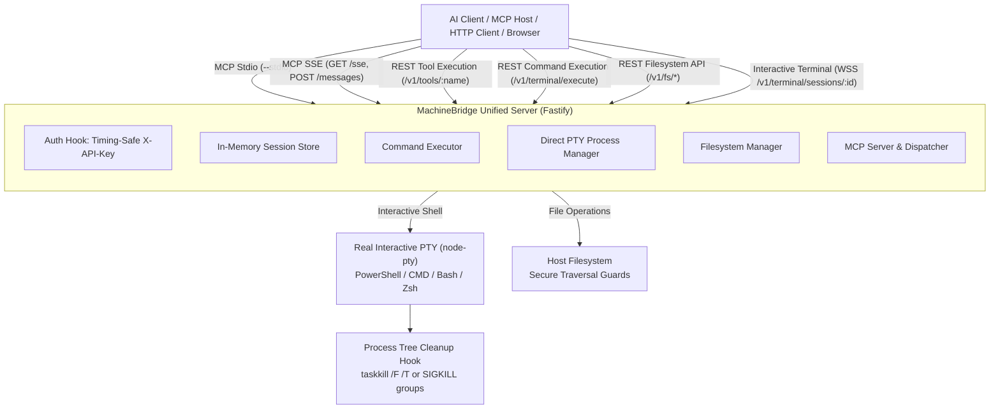

# MachineBridge (Node.js / TypeScript)

TypeScript / Node.js implementation and companion SDK for **MachineBridge**, the high-performance unified remote PTY, filesystem, and Model Context Protocol (MCP) system.

> **Note**: The primary, canonical high-performance engine for MachineBridge is the native C++20 implementation at [**machinebridge-cpp**](../machinebridge-cpp). This project provides the modular TypeScript/Node.js ecosystem implementation.



The core design principle: **MachineBridge provides a real PTY terminal and host filesystem manager, not a collection of ad-hoc command wrappers.** An AI agent or client can run Git, Node, Python, Docker, compilers, and complex workflows naturally.

---

## Workspace Structure

```text
machinebridge/
├── apps/
│   ├── server/         # Unified server (HTTP REST, WebSocket PTY, MCP SSE & Stdio)
│   └── cli/            # Interactive reference terminal client
├── packages/
│   ├── pty/            # Standalone PTY manager, shell detection & process-tree termination
│   ├── fs/             # Filesystem manager with path-traversal & device security guards
│   ├── tunnel/         # Cloudflare Tunnel integration via JacobLinCool/node-cloudflared
│   ├── config/         # Environment & configuration loading
│   ├── crypto/         # Ed25519 signing and timing-safe helpers
│   ├── protocol/       # Zod wire protocol schemas & binary codec
│   └── shared/         # Timing-safe API key verification & batch formatters
├── tests/              # 8 test suites covering tools, tunnel, PTY, FS, protocol, server
└── docs/               # Architecture, protocol, security, and skills documentation
```

---

## Cloudflare Tunnel (Public Port Exposure)

To expose the MachineBridge server over a secure public HTTPS Cloudflare Tunnel without manual port forwarding or firewall adjustments, set the `MACHINEBRIDGE_EXPOSE_TUNNEL` environment variable:

```bash
# Enable auto-provisioned quick tunnel (https://*.trycloudflare.com)
MACHINEBRIDGE_EXPOSE_TUNNEL=true pnpm dev
```

Upon startup, MachineBridge provisions a tunnel via `cloudflared`:

```text
[MachineBridge Tunnel] Public HTTPS URL: https://xxxx-xxxx.trycloudflare.com
```

The active tunnel URL is also reported by the health check endpoint:

```json
{
  "ok": true,
  "service": "machinebridge-unified",
  "tunnelUrl": "https://xxxx-xxxx.trycloudflare.com"
}
```

If you have a named Cloudflare Tunnel with a custom domain, provide your token:

```bash
MACHINEBRIDGE_EXPOSE_TUNNEL=true MACHINEBRIDGE_TUNNEL_TOKEN="your-tunnel-token" pnpm dev
```

All incoming requests over the public tunnel are protected by constant-time `X-API-Key` authentication. On server shutdown, the `cloudflared` process tree is terminated automatically.

---

## Verified MCP Tools (15 Tools)

All 15 tools are accessible via **MCP (Stdio & SSE)** as well as directly via **HTTP REST** (`GET`/`POST` `/tools/:name` or `/v1/tools/:name`):

| Tool               | Category    | Description                                                                                       |
| :----------------- | :---------- | :------------------------------------------------------------------------------------------------ |
| `execute_command`  | Shell / PTY | Execute a command in a real interactive PTY and capture exit code and output.                     |
| `execute_commands` | Shell / PTY | Execute a batch sequence of commands with `stopOnError` and summary timing.                       |
| `read_file`        | Filesystem  | Read file content with offset/length chunking and utf8/base64 encoding.                           |
| `write_file`       | Filesystem  | Create, overwrite, or append content to a file; returns written bytes and SHA-256.                |
| `stat_file`        | Filesystem  | Retrieve file metadata (`size`, `isFile`, `isDirectory`, `mtime`, `birthtime`).                   |
| `copy_file`        | Filesystem  | Copy file or directory recursively.                                                               |
| `move_file`        | Filesystem  | Move or rename file or directory.                                                                 |
| `list_directory`   | Filesystem  | List files and directories with metadata (supports recursive traversal).                          |
| `delete_file`      | Filesystem  | Delete file or directory recursively.                                                             |
| `make_directory`   | Filesystem  | Create directories recursively.                                                                   |
| `batch_fs`         | Filesystem  | Run atomic or sequential batch operations (`write`, `read`, `copy`, `move`, `delete`, `command`). |
| `create_session`   | Terminal    | Create a persistent interactive PTY session (returns `sessionId`, `pid`).                         |
| `send_input`       | Terminal    | Send stdin input text or signals (`SIGINT`, `SIGTERM`, etc.) to active session.                   |
| `read_output`      | Terminal    | Read buffered stdout/stderr from active session.                                                  |
| `close_session`    | Terminal    | Terminate active session and forcefully kill its entire process tree.                             |

---

## Authentication

All HTTP and WebSocket endpoints require an API key passed via:

- Header: `X-API-Key: <key>`
- Header: `Authorization: Bearer <key>`
- Query param (WebSocket only): `?token=<key>` or `?apiKey=<key>`

Default development API key: `machinebridge-dev-key` (configurable via `MACHINEBRIDGE_API_KEY`).

---

## Quick Start

### 1. Build

```bash
pnpm install
pnpm build
```

### 2. Start the Server in HTTP / SSE Mode

```bash
pnpm dev:server
# Server listens on http://localhost:8080
```

### 3. Run in MCP Stdio Mode (for Claude Desktop, Cursor, etc.)

```bash
node apps/server/dist/main.js --stdio
```

### 4. Interactive CLI Client

```bash
pnpm dev:cli -- shell --server http://localhost:8080 --api-key machinebridge-dev-key
```

---

## API Endpoints

### Health & Tools

- `GET /health` - Health check (unauthenticated)
- `GET /ready` - Readiness check (unauthenticated)
- `GET /tools` - List all 15 MCP tools and schemas
- `POST /tools/:name` (or `GET`) - Directly execute any MCP tool via REST

### Command Execution

- `POST /v1/terminal/execute` - Execute a single command
- `POST /v1/terminal/execute-batch` - Execute a batch of commands sequentially

### Interactive Terminal Sessions

- `POST /v1/terminal/sessions` - Allocate an interactive session
- `GET  /v1/terminal/sessions/:id` - Query session metadata
- `POST /v1/terminal/sessions/:id/input` - Send stdin data or signals
- `GET  /v1/terminal/sessions/:id/output` - Read buffered output
- `POST /v1/terminal/sessions/:id/close` - Close session
- `WSS  /v1/terminal/sessions/:id` - Raw bi-directional terminal streaming

### Filesystem

- `GET /v1/fs/read`, `POST /v1/fs/read` - Read file
- `POST /v1/fs/write` - Write file
- `POST /v1/fs/delete`, `DELETE /v1/fs` - Delete file/dir
- `GET /v1/fs/list`, `POST /v1/fs/list` - List directory
- `POST /v1/fs/mkdir` - Create directory
- `POST /v1/fs/move` - Move/rename
- `POST /v1/fs/copy` - Copy
- `POST /v1/fs/batch` - Batch filesystem operations

### Model Context Protocol (MCP)

- `GET  /sse` - MCP Server-Sent Events stream
- `POST /messages` - MCP JSON-RPC message endpoint

---

## Automatic Cleanup

When a session ends, times out, or when the server process exits (`SIGINT`, `SIGTERM`, `exit`, or standard input close):

- On Windows: Uses `taskkill /F /T /PID <pid>` to terminate child and grandchild processes.
- On POSIX: Uses process-group `SIGKILL` and `pkill -9 -P` to prevent orphaned processes.

---

## Testing & Quality Checks

```bash
pnpm build
pnpm test:unit
pnpm lint
pnpm format:check
```

## Security model

- Agents authenticate with a registered Ed25519 key pair.
- Private keys stay on the machine.
- Agent hello messages contain a timestamp, nonce, request ID, payload hash and signature.
- The Edge verifies the public key, signature, timestamp and replay nonce.
- Client credentials are exchanged for short-lived HMAC-signed tokens.
- User → device → session authorization is checked before terminal traffic is routed.
- WebSocket payloads have bounded size and terminal output has bounded buffering.
- Terminal content is not audit logged by default.
- Production deployments should terminate WSS with TLS, use strong secrets, least-privilege OS accounts, managed PostgreSQL, distributed rate/replay storage, and an explicit approval/policy layer for privileged machines.

## Important boundary

An authorized terminal is intentionally powerful. MachineBridge does not attempt to secure the system with unreliable command blacklists such as `block rm` or `block sudo`. Authorization and deployment isolation are the security boundary.
